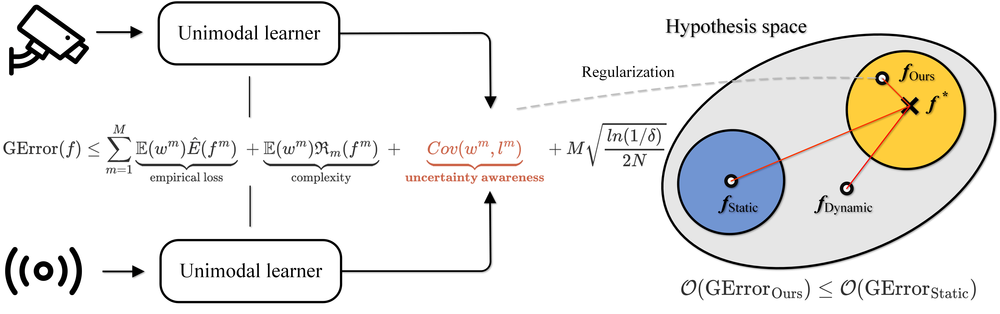

# Provable Dynamic Fusion for Low-Quality Multimodal Data


This is the official implementation for [Provable Dynamic Fusion for Low-Quality Multimodal Data](https://icml.cc/virtual/2023/poster/25229) (ICML 2023) by Qingyang Zhang, Haitao Wu, Changqing Zhang , Qinghua Hu, Huazhu Fu, Joey Tianyi Zhou and Xi Peng

- This paper provides a theoretical framework to understand the criterion of robust dynamic multimodal fusion.
- A novel dynamic multimodal fusion method termed Quality-aware Multimodal Fusion (QMF) is proposed for provably better generalization ability.


<p align="center">

</p>

## Enviroment setup

```
pip install -r requirements.txt
```

## Dataset preparation

- Text-Image Classification: 

  Step 1: Download [food101](https://www.kaggle.com/datasets/gianmarco96/upmcfood101) and [MVSA_Single](https://www.kaggle.com/datasets/vincemarcs/mvsasingle) and put them in the folder *datasets*.

  Step 2: Prepare the train/dev/test splits jsonl files. We follow the [MMBT](https://github.com/facebookresearch/mmbt) settings and provide them in corresponding folders.

  Step 3 (optional): If you want use Glove model for Bow model, you can download [glove.840B.300d.txt](https://www.kaggle.com/datasets/takuok/glove840b300dtxt) and put it in the folder *datasets/glove_embeds*. For bert model, you can download [bert-base-uncased](https://huggingface.co/google-bert/bert-base-uncased) ([Google Drive Link](https://drive.google.com/file/d/1INsaOg6_LtvlaJtQuPyn3_wgsCDZZKwU/view?usp=sharing) ) and put in the root folder *bert-base-uncased/*.

- RGBD Scene Recognition:

   Step 1: Download [NYUD2](https://drive.google.com/file/d/1F_BJ9iAJF8atCgSf1xW1NIZJYMssj0-y/view?usp=drive_link) and [SUNRGBD](https://drive.google.com/file/d/1XzgYNsez-glZIYMt_6jni2mbVf1mWvT9/view?usp=drive_link) and put them in the folder *datasets.*

Feel free to use Baidu Netdisk for [food101](https://pan.baidu.com/s/1Tj7jRptTt2V6bxfwrvDSQg?pwd=5jy4) [MVSA_Single](https://pan.baidu.com/s/1URVP8AifWuwIFy6v0uAPOA?pwd=18fw) [NYUD2](https://pan.baidu.com/s/1214yDgGeOIbSsWly2MLnuA?pwd=xhq3) [SUNRGBD](https://pan.baidu.com/s/1HiHRwuGdnFPlZ9gvGyOZEg?pwd=pv6m).

## Trained Model
We provide the trained models at [Baidu Netdisk](https://pan.baidu.com/s/1fPltY-QP0YDuthbg89D_aA?pwd=8995).

Pretrained bert model at [Baidu Netdisk](https://pan.baidu.com/s/1TMg1uiMTZNxKT1O62wgfvg?pwd=zu13).

We use the pytorch official pretrained resnet18 in RGB-D classification tasks, which can be downloaded from [this link](https://s3.amazonaws.com/pytorch/models/resnet18-5c106cde.pth).

## Usage Example: Text-Image Classification
Note: Sheels for reference are provided in the folder *shells*

To run our method on benchmark datasets:
- task="MVSA_Single" or "food101"
- task_type="classification"
- model="latefusion"
- name=$task"_"$model"_model_run_df_$i"
```
python train_qmf.py --batch_sz 16 --gradient_accumulation_steps 40  \
    --savedir ./saved/$task --name $name  --data_path ./datasets/ \
    --task $task --task_type $task_type  --model $model --num_image_embeds 3 \
    --freeze_txt 5 --freeze_img 3   --patience 5 --dropout 0.1 --lr 5e-05 --warmup 0.1 --max_epochs 100 --seed $i --df true --noise 0.0
```

To run tmc:
```
python train_tmc.py --batch_sz 16 --gradient_accumulation_steps 40  \
    --savedir ./saved/$task --name $name  --data_path ./datasets/ \
    --task $task --task_type $task_type  --model $model --num_image_embeds 3 \
    --freeze_txt 5 --freeze_img 3   --patience 5 --dropout 0.1 --lr 5e-05 --warmup 0.1 --max_epochs 100 --seed $i --df true --noise 0.0
```

To run Others:
- task="MVSA_Single" or "food101"
- task_type="classification"
- model="bow" "bert" "img" "concatbert" "concatbow" "mmbt"
- name=$task"_"$model"_model_run_$i"
```
python train.py --batch_sz 16 --gradient_accumulation_steps 40  \
    --savedir ./saved/$task --name $name  --data_path ./datasets/ \
    --task $task --task_type $task_type  --model $model --num_image_embeds 3 \
    --freeze_txt 5 --freeze_img 3   --patience 5 --dropout 0.1 --lr 5e-05 --warmup 0.1 --max_epochs 100 --seed $i --df true --noise 0.0
```


## Citation

If our QMF or the idea of dynamic multimodal fusion methods are helpful in your research, please consider citing our paper:

```
@inproceedings{zhang2023provable,
  title={Provable Dynamic Fusion for Low-Quality Multimodal Data},
  author={Zhang, Qingyang and Wu, Haitao and Zhang, Changqing and Hu, Qinghua and Fu, Huazhu and Zhou, Joey Tianyi and Peng, Xi},
  booktitle={International Conference on Machine Learning},
  year={2023}
}
```

## Acknowledgement

The code is inspired by [TMC: Trusted Multi-View Classification](https://github.com/hanmenghan/TMC) and [Confidence-Aware Learning for Deep Neural Networks](https://github.com/daintlab/confidence-aware-learning).

## Related works

There are many interesting works related to this paper:

- [Uncertainty-based Fusion Netwok for Automatic Skin Lesion Diagnosis](https://ieeexplore.ieee.org/document/9994932/)
- [Uncertainty Estimation for Multi-view Data: The Power of Seeing the Whole Picture](https://arxiv.org/abs/2210.02676)
- [Reliable Multimodality Eye Disease Screening via Mixture of Student's t Distributions](https://arxiv.org/abs/2303.09790)
- [Trusted Multi-Scale Classification Framework for Whole Slide Image](https://arxiv.org/abs/2207.05290)
- [Fast Road Segmentation via Uncertainty-aware Symmetric Network](https://arxiv.org/abs/2203.04537)
- [Trustworthy multimodal regression with mixture of normal-inverse gamma distributions](https://arxiv.org/abs/2111.08456)
- [Uncertainty-Aware Multiview Deep Learning for Internet of Things Applications](https://ieeexplore.ieee.org/document/9906001/)
- [Automated crystal system identification from electron diffraction patterns using multiview opinion fusion machine learning](https://chemrxiv.org/engage/chemrxiv/article-details/644beb010d87b493e3718ca8)
- [Trustworthy Long-Tailed Classification](https://arxiv.org/abs/2111.09030)
- [Trusted multi-view deep learning with opinion aggregation](https://ojs.aaai.org/index.php/AAAI/article/view/20724)
- [EvidenceCap: Towards trustworthy medical image segmentation via evidential identity cap](https://www.arxiv-vanity.com/papers/2301.00349/)
- [Federated Uncertainty-Aware Aggregation for Fundus Diabetic Retinopathy Staging](https://arxiv.org/abs/2303.13033)
- [Multimodal dynamics: Dynamical fusion for trustworthy multimodal classification](https://openaccess.thecvf.com/content/CVPR2022/papers/Han_Multimodal_Dynamics_Dynamical_Fusion_for_Trustworthy_Multimodal_Classification_CVPR_2022_paper.pdf)

For any additional questions, feel free to email qingyangzhang@tju.edu.cn.
